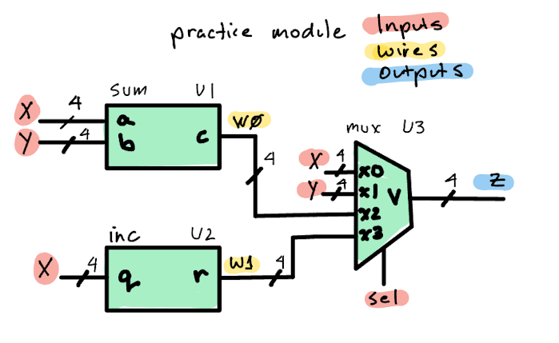

# Practice 1: Module Instantiation

## Objective

In this exercise you will practice **instantiating modules** by connecting pre-built components according to an RTL diagram.

## Your Task

Open `rtl/practice.v` and complete the module by:

1. Declaring two internal 4-bit wires: `W0` and `W1`
2. Instantiating the `sum` module as `U1`
3. Instantiating the `inc` module as `U2`
4. Instantiating the `mux` module as `U3`

Refer to the RTL diagram for the correct port connections.



## Module Reference

| Module | Instance | Ports |
|--------|----------|-------|
| `sum`  | U1 | `a` [3:0], `b` [3:0] → `c` [3:0] |
| `inc`  | U2 | `q` [3:0] → `r` [3:0] |
| `mux`  | U3 | `x0` [3:0], `x1` [3:0], `x2` [3:0], `x3` [3:0], `sel` [1:0] → `v` [3:0] |

## Expected Behavior

| sel | Z output |
|-----|----------|
| 00  | X        |
| 01  | Y        |
| 10  | X + Y    |
| 11  | X + 1    |

## Testing

Push your changes to GitHub. The CI workflow will automatically compile and run the testbench. You can also test locally with Icarus Verilog:

```bash
iverilog -o sim.vvp -s practice_tb rtl/sum.v rtl/inc.v rtl/mux.v rtl/practice.v tb/practice_tb.v
vvp sim.vvp
```

## Submission

Your assignment passes when the GitHub Actions workflow shows a green checkmark (all tests pass).
